# Real-time AI Voice Conversation

[](https://www.python.org/)
[](https://fastapi.tiangolo.com/)
[](https://developer.mozilla.org/en-US/docs/Web/API/WebSockets_API)
[](https://azure.microsoft.com/en-us/products/ai-services/speech-services)
[](https://openai.com/)
[](LICENSE)

English | [中文](README.md)

A low-latency, high-quality real-time voice conversation platform that allows users to have natural conversations with AI through a microphone. The system uses a streaming architecture, supporting dynamic conversation flow with real-time interruption and intelligent turn detection.

## Architecture

```mermaid
graph TB
    subgraph Client["🌐 Client (Web Browser)"]
        MIC[🎤 Microphone]
        SPK[🔊 Speaker]
        UI[Web UI]
    end

    subgraph Server["⚙️ Server (FastAPI)"]
        WS[WebSocket Handler]
        
        subgraph Pipeline["Voice Processing Pipeline"]
            STT[🗣️ STT<br/>Azure Speech]
            LLM[🧠 LLM<br/>OpenAI/Local]
            TTS[🔈 TTS<br/>Azure/MiniMax]
        end
        
        SM[Session Manager]
        VAD[Voice Activity<br/>Detection]
    end

    MIC -->|PCM Audio| WS
    WS -->|Audio Stream| STT
    STT -->|Text| LLM
    LLM -->|Response| TTS
    TTS -->|PCM Audio| WS
    WS -->|Audio Stream| SPK
    
    WS <-->|State Sync| SM
    WS -->|Interruption| VAD
    
    UI <-->|Commands| WS
```



### Data Flow

```mermaid
graph LR
    A[🎤 Microphone] -->|PCM Capture| B[WebSocket]
    B -->|Audio Stream| C[STT]
    C -->|Text| D[LLM]
    D -->|Response| E[TTS]
    E -->|Audio Stream| F[WebSocket]
    F -->|PCM Playback| G[🔊 Speaker]
    
    style A fill:#e1f5fe
    style G fill:#e1f5fe
    style D fill:#fff3e0
```



### WebSocket Protocol

The system uses WebSocket for real-time bidirectional communication, supporting the following message types:

#### Client to Server Messages

| Message Type | Format                       | Purpose                    |
|--------------|------------------------------|----------------------------|
| `start`      | `{"type": "start"}`          | Start conversation         |
| `stop`       | `{"type": "stop"}`           | Stop conversation          |
| `reset`      | `{"type": "reset"}`          | Reset conversation state   |
| `interrupt`  | `{"type": "interrupt"}`      | Request interruption       |

#### Server to Client Messages

| Message Type            | Format                                                                                         | Purpose                   |
|-------------------------|------------------------------------------------------------------------------------------------|---------------------------|
| `partial_transcript`    | `{"type": "partial_transcript", "content": "text", "session_id": "id"}`                        | Real-time transcription   |
| `final_transcript`      | `{"type": "final_transcript", "content": "text", "session_id": "id"}`                          | Final transcription       |
| `llm_status`            | `{"type": "llm_status", "status": "processing", "session_id": "id"}`                           | LLM processing status     |
| `llm_response`          | `{"type": "llm_response", "content": "text", "is_complete": true/false, "session_id": "id"}`   | AI text response          |
| `tts_start`             | `{"type": "tts_start", "format": "pcm", "session_id": "id"}`                                   | TTS audio start           |
| `tts_end`               | `{"type": "tts_end", "session_id": "id"}`                                                      | TTS audio end             |
| `tts_stop`              | `{"type": "tts_stop", "session_id": "id"}`                                                     | Stop TTS playback         |
| `status`                | `{"type": "status", "status": "listening/stopped", "session_id": "id"}`                        | System status update      |
| `error`                 | `{"type": "error", "message": "error message", "session_id": "id"}`                            | Error message             |
| `stop_acknowledged`     | `{"type": "stop_acknowledged", "message": "stopped", "queues_cleared": true, "session_id": "id"}` | Stop confirmation      |
| `interrupt_acknowledged`| `{"type": "interrupt_acknowledged", "session_id": "id"}`                                       | Interrupt confirmation    |

#### Binary Audio Data

In addition to JSON messages, the system transmits binary audio data via WebSocket:

**Client to Server**:
- Format: `[8-byte header][PCM audio data]`
- Header: `[4-byte timestamp][4-byte status flags]`
- Status flags contain audio energy, microphone status, etc.

**Server to Client**:
- Format: Direct PCM audio data transmission
- Paired with `tts_start` and `tts_end` messages to mark audio stream boundaries

### Audio Specifications

#### Client to Server (User Voice)
- **Audio Format**: 16-bit PCM
- **Sample Rate**: 24kHz
- **Channels**: Mono
- **Protocol**: WebSocket binary
- **Chunk Size**: 2048 samples/chunk

#### Server to Client (AI Voice)
- **Audio Format**: 16-bit PCM
- **Sample Rate**: 24kHz
- **Channels**: Mono
- **Protocol**: WebSocket binary

### Voice Processing

#### Speech Recognition (STT)
- **Engine**: Azure Speech Services

#### Text Generation (LLM)
- **Supported**:
  - OpenAI API
  - Compatible local services

#### Text-to-Speech (TTS)
- **Supported Engines**:
  - Azure TTS
  - MiniMax TTS

## Installation

1. Clone the repository
```bash
git clone https://github.com/chicogong/realtime-ai.git
cd realtime-ai
```

2. Install dependencies
```bash
pip install -r requirements.txt
```

3. Configure environment variables
```bash
cp .env.example .env
# Edit .env file with your API keys
```

4. Run the application
```bash
python app.py
```

5. Open `http://localhost:8000` in your browser

## Project Structure

```
├── app.py              # Application entry point
├── config.py           # Configuration settings
├── session.py          # Session management
├── services/           # Service modules
│   ├── asr/            # Speech recognition
│   ├── llm/            # Language model
│   └── tts/            # Text-to-speech
├── websocket/          # WebSocket handling
│   ├── handler.py      # Connection handler
│   └── pipeline.py     # Processing pipeline
├── static/             # Frontend assets
│   ├── css/            # Stylesheets
│   ├── js/             # JavaScript files
│   └── index.html      # Main HTML interface
└── utils/              # Utility functions
```

## Features

- Real-time speech-to-text recognition
- Streaming LLM responses
- High-quality text-to-speech synthesis
- Interruption detection
- Natural conversation flow

## Contributing

Contributions are welcome! Please see the [Contributing Guide](CONTRIBUTING.md).

## License

[MIT](LICENSE)
