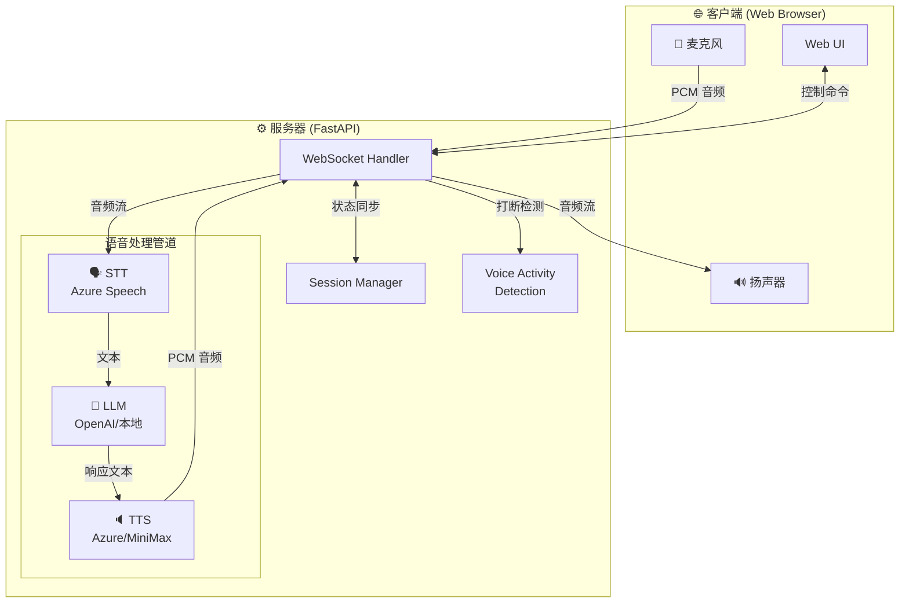
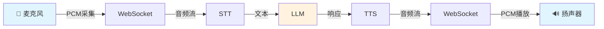

# 实时AI语音对话

[](https://www.python.org/)
[](https://fastapi.tiangolo.com/)
[](https://developer.mozilla.org/en-US/docs/Web/API/WebSockets_API)
[](https://azure.microsoft.com/en-us/products/ai-services/speech-services)
[](https://openai.com/)
[](LICENSE)

[English](README.en.md) | 中文

一个低延迟、高质量的实时语音对话平台，允许用户通过麦克风与AI进行自然对话。系统采用流式处理架构，支持动态对话流程，包括实时打断和智能转向检测。

## 系统架构



### 数据流程



### WebSocket协议

系统使用WebSocket进行实时双向通信，支持以下消息类型：

#### 客户端到服务器消息

| 消息类型     | 格式                         | 用途                  |
|--------------|------------------------------|------------------------|
| `start`      | `{"type": "start"}`          | 开始对话               |
| `stop`       | `{"type": "stop"}`           | 停止对话和处理         |
| `reset`      | `{"type": "reset"}`          | 重置对话状态           |
| `interrupt`  | `{"type": "interrupt"}`      | 客户端请求打断当前响应 |

#### 服务器到客户端消息

| 消息类型                | 格式                                                                                           | 用途                    |
|-------------------------|------------------------------------------------------------------------------------------------|-------------------------|
| `partial_transcript`    | `{"type": "partial_transcript", "content": "文本", "session_id": "会话ID"}`                    | 实时转录字幕            |
| `final_transcript`      | `{"type": "final_transcript", "content": "文本", "session_id": "会话ID"}`                      | 最终转录结果            |
| `llm_status`            | `{"type": "llm_status", "status": "processing", "session_id": "会话ID"}`                       | LLM处理状态             |
| `llm_response`          | `{"type": "llm_response", "content": "文本", "is_complete": true/false, "session_id": "会话ID"}` | AI文本回复              |
| `tts_start`             | `{"type": "tts_start", "format": "格式", "is_first": true/false, "text": "文本", "session_id": "会话ID"}` | TTS音频开始            |
| `tts_end`               | `{"type": "tts_end", "session_id": "会话ID"}`                                                 | TTS音频结束             |
| `tts_stop`              | `{"type": "tts_stop", "session_id": "会话ID"}`                                                | 通知客户端停止TTS音频播放 |
| `status`                | `{"type": "status", "status": "listening/stopped", "session_id": "会话ID"}`                    | 系统状态更新            |
| `error`                 | `{"type": "error", "message": "错误信息", "session_id": "会话ID"}`                             | 错误消息                |
| `stop_acknowledged`     | `{"type": "stop_acknowledged", "message": "所有处理已停止", "queues_cleared": true, "session_id": "会话ID"}` | 停止命令确认回复        |
| `interrupt_acknowledged`| `{"type": "interrupt_acknowledged", "session_id": "会话ID"}`                                  | 中断请求确认回复        |

#### 二进制音频数据

除了JSON消息外，系统还通过WebSocket传输二进制音频数据：

**客户端到服务器**：
- 格式: `[8字节头部][PCM音频数据]`
- 头部: `[4字节时间戳][4字节状态标志]`
- 状态标志包含音频能量、麦克风状态等信息

**服务器到客户端**：
- 格式: 直接传输PCM音频数据
- 配合`tts_start`和`tts_end`消息标记音频流的开始和结束

### 音频传输规范

#### 客户端到服务器（用户语音）
- **音频格式**: 16位PCM
- **采样率**: 24kHz
- **声道数**: 单声道
- **传输协议**: WebSocket二进制传输
- **分块大小**: 2048样本/块

#### 服务器到客户端（AI语音）
- **音频格式**: 16位PCM
- **采样率**: 24kHz
- **声道数**: 单声道
- **传输协议**: WebSocket二进制数据

### 语音处理

#### 语音识别(STT)
- **引擎**: Azure语音服务

#### 文本生成(LLM)
- **支持**:
  - OpenAI API
  - 兼容的本地服务

#### 语音合成(TTS)
- **支持引擎**:
  - Azure TTS
  - MiniMax TTS

## 安装与设置

1. 克隆代码库
```bash
git clone https://github.com/chicogong/realtime-ai.git
cd realtime-ai
```

2. 安装依赖
```bash
pip install -r requirements.txt
```

3. 配置环境变量
```bash
cp .env.example .env
# 编辑 .env 文件，填入你的 API 密钥
```

4. 运行应用
```bash
python app.py
```

5. 在浏览器中打开 `http://localhost:8000`

## 项目结构

```
├── app.py              # 应用程序入口点
├── config.py           # 配置设置
├── session.py          # 会话管理
├── services/           # 服务模块
│   ├── asr/            # 语音识别服务
│   ├── llm/            # 语言模型服务
│   └── tts/            # 文本到语音服务
├── websocket/          # WebSocket 处理
│   ├── handler.py      # 连接处理
│   └── pipeline.py     # 处理管道
├── static/             # 前端资源
│   ├── css/            # 样式表
│   ├── js/             # JavaScript 文件
│   └── index.html      # 主界面
└── utils/              # 工具函数
```

## 功能特点

- 实时语音转文字识别
- 流式LLM响应
- 高质量文本到语音合成
- 打断检测
- 自然对话流程

## 贡献

欢迎贡献！请查看 [贡献指南](CONTRIBUTING.md)。

## 许可证

[MIT](LICENSE)
